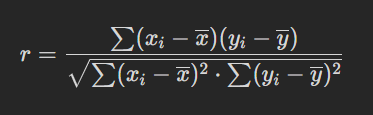
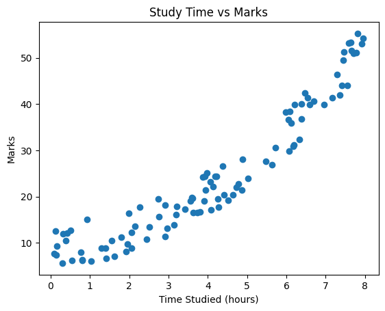

# 🌄 Student Performance Correlation Analysis

- [Overview](#-overview)
- [Tools Used](#-tools-used)
- [Files](#️-files)
- [Correlation Analysis](#-correlation-analysis)
- [Linear Regression Analysis](#-linear-regression-analysis)
- [Insight](#-insight)
- [How to Run 👈](#how-to-run-)

## 🚀 Overview

This project involves analyzing the correlation between student grades and the hours they studied and linear regression analysis for predicting the amount of marks a student might get based on the hour they studied. The analysis is performed using Python, with a focus on data manipulation and visualization using libraries such as Pandas and Jupyter Notebook. The primary goal is to identify patterns and correlations within the data that can inform educational strategies and interventions. The project includes steps for data cleaning, exploratory data analysis, and correlation analysis to understand the relationships between study hours and academic performance.


## 💼 Tools Used


### 🛰️ Files

- [`data.csv`](./data/data.csv) - used as primary source of data
- [`main.ipynb`](./src/main.ipynb) - used for analysis

### 🔥 Correlation Analysis

Correlation analysis is a statistical technique used to measure and describe the strength and direction of a linear relationship between two quantitative variables. In other words, it helps answer the question, "How closely are two variables related?"

Key points about correlation analysis:

- **Pearson’s Correlation Coefficient (r):**
    
    The most common measure, Pearson’s r, ranges from –1 to +1.
    
    - **+1:** Perfect positive linear relationship (as one variable increases, so does the other).
    - **–1:** Perfect negative linear relationship (as one variable increases, the other decreases).
    - **0:** No linear relationship exists.
- **Interpretation:**
    - **Calculation:**
        
        

        Here, $x_i$ and $y_i$  are the individual data points, while $\overline{x}$ and  $\overline{y}$ represent the means of the x and y datasets respectively.
        
    
    The sign of r indicates the direction of the relationship (positive or negative), and the magnitude (absolute value) indicates the strength of the linear association.

### 🔥Linear Regression Analysis

Regression analysis is a statistical technique that models the relationship between a dependent variable (also called the outcome or response) and one or more independent variables (predictors). The main goals of regression analysis are to:

1. **Quantify Relationships:**
    - It measures how changes in independent variables affect the dependent variable.
    - For example, in simple linear regression, the relationship follows this equation:
    where:
        
        ```math
        y = α + βx
        ```
        
        - α represents the intercept (y's value when x equals 0),
        - β represents the slope (the change in y for each one-unit increase in x).

```math 
β = \frac{\sum (x_i - \overline{x})(y_i - \overline{y})}{\sum (x_i-\overline{x})^2 }
```

```math
α=\overline{y}−β\overline{x}
```

$x$ is the independent variable (which is what we observe to see the output or used for comparison)

$y$ is the dependent variable (which is our goal)

$\overline{x}$ is the mean of $x$

$\overline{y}$ is the mean of $y$

$x_i$ represents each value in $x$

$y_i$ represents each value in $y$

### 📖 Insight


### How to Run 👈
- Clone the repository using 
    ```bash
    git clone https://github.com/TahsinAyman/student_performance_diagonistic_analysis.git
    ```
- Under a stable `Jupyter` environment open [`main.ipynb`](./src/main.ipynb) file
